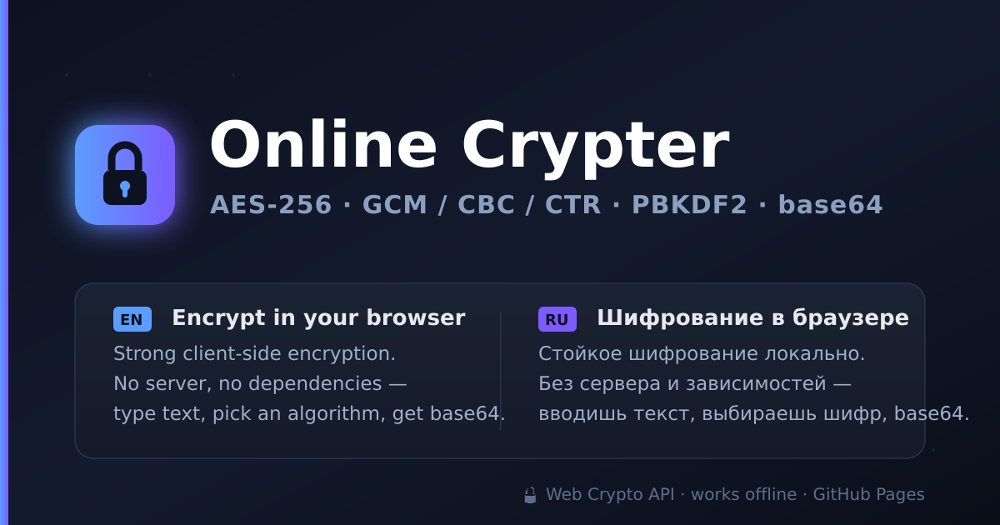

# 🔐 Online Crypter

**v1.0.0** · [Русская версия →](README_RU.md)

Strong, client-side text encryption that runs entirely in your browser. Type text, pick an algorithm, and get **base64** output — decrypt it back with the same password. No server, no tracking, **no external dependencies**. A single self-contained `index.html`.

**Live:** https://j0k.github.io/online2b64/



## Features

- **Three authenticated algorithms** (all AES-256):
  - **AES-256-GCM** — authenticated encryption (AEAD), integrity built in. *Recommended.*
  - **AES-256-CBC + HMAC-SHA256** — Encrypt-then-MAC.
  - **AES-256-CTR + HMAC-SHA256** — stream mode with a separate HMAC.
- **Password-based** — the key is derived from your passphrase with **PBKDF2-SHA256** (210,000 iterations, a fresh random 16-byte salt per encryption).
- **Base64 output** — salt, IV and algorithm id are packed into the output, so decryption needs only the password.
- **Integrity checked** — a wrong password or tampered data is rejected *before* decryption (constant-time comparison), instead of returning garbage.
- **Bilingual UI** — EN / RU switch, remembered in `localStorage`.
- **Runs offline** and 100% locally — nothing is ever sent to a server.
- Light / dark theme follows your system.

## Usage

1. Open the [live page](https://j0k.github.io/online2b64/) (or `index.html` locally over HTTPS).
2. Choose an algorithm and enter a **password**.
3. Type your text and press **🔒 Encrypt** → copy the base64 result.
4. To reverse: paste the base64, enter the **same password**, press **🔓 Decrypt**.

> ⚠️ There is no password recovery. If you lose the password, the data cannot be decrypted.

## How it works

The key is derived from your password via PBKDF2-SHA256. Encryption uses the browser-native [Web Crypto API](https://developer.mozilla.org/docs/Web/API/Web_Crypto_API) (`crypto.subtle`).

Output byte layout, then base64-encoded:

```
[ version(1) | algorithm(1) | iterations(4, BE) | salt(16) | IV | ciphertext ] (+ HMAC(32) for CBC/CTR)
```

For AES-GCM the authentication tag is part of the ciphertext. For CBC/CTR an HMAC-SHA256 over the whole message (Encrypt-then-MAC) is appended.

## Security notes

- **AES-256 is already more than enough** — there is no "AES-512"; AES is standardized only for 128/192/256-bit keys. Real-world strength depends on your **password**, not on adding more key bits.
- Client-side crypto protects data at rest / in transit through untrusted channels; it does **not** protect against a compromised device or a weak password.
- Requires **HTTPS** (Web Crypto is unavailable on plain `http://` and `file://` in some browsers). GitHub Pages serves HTTPS.

## Deploy on GitHub Pages

1. Push the repo (contains `index.html` + `preview.png`).
2. **Settings → Pages → Source: Deploy from a branch → `main` / `root`.**
3. Open `https://<user>.github.io/<repo>/`.

## License

MIT — do whatever you want; no warranty.
